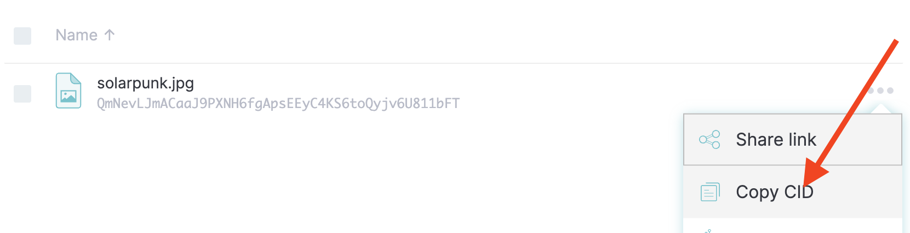

# IPFS to Swarm

## 1. Introduction

Swarm is a fully decentralized, censorship-resistant peer-to-peer storage network powered by Bee nodes. Unlike IPFS, it doesn't rely on any centralized third-party infrastructure. Swarm's mission is to empower a self-sovereign global society and open, permissionless markets by offering scalable decentralized storage for Web3. Its incentive system runs on smart contracts on the Gnosis Chain and is fueled by the xBZZ token, ensuring economic sustainability.

### 1.1 Why choose Swarm over IPFS

Swarm offers several advantages over IPFS, especially in decentralized storage and content distribution.

* **Atomic Unit**: Swarm uses 4 kB chunks (compared to IPFS’s 256 kB), enabling more efficient storage and faster retrieval of small files.
* **Mutable pointers**: Feeds allow dynamic content updates without changing the content address.
* **Download speed**: Unlike IPFS, even rarely accessed files download quickly; popular files are even faster.
* **Censorship Resistance**: Content is nearly impossible to remove, protecting against internal or external censorship.
* **DDOS Resistance**: The architecture resists DDoS attacks, ensuring content availability under stress.
* **Privacy/Anonymity**: Strong privacy and anonymity features make it ideal for sensitive data.
* **Storage Payment**: Integrated BZZ token system enables decentralized storage payments.
* **Incentives**: BZZ token rewards motivate users to contribute storage resources to the network.

### 1.2 Comparison of Swarm to IPFS

| Feature                     | Swarm                                                 | IPFS                                                  |
|-----------------------------|-------------------------------------------------------|-------------------------------------------------------|
| Data Availability           | Guaranteed via incentivized storage and retrieval     | No guarantees – relies on external pinning services.  |
| Retrievability              | Native bandwidth market ensures persistent delivery   | No native incentives for retrieval                    |
| Persistence Guarantees      | Long-term through economic incentives                 | Ephemeral unless actively pinned                      |
| Privacy & Access Control    | Built-in encryption and on-chain ACT permissions.     | No native encryption or access management.            |
| Censorship Resistance       | High – fully decentralized with autonomous guarantees | Limited – centralized services can be pressure points |
| Architecture                | Decentralized storage service                         | Decentralized protocol                                |
| Infrastructure Dependencies | Self-sustaining network                               | Typically needs third-party infrastructure            |
| Target Use Case             | Production-grade dApps with long-term requirements    | File sharing and prototypes, not production storage.  |

### 1.3 Further reading about Swarm – official documentation

For a comprehensive understanding of Swarm, start with the following official resources:

* [Book of Swarm](https://papers.ethswarm.org/p/book-of-swarm/) – Foundational document covering Swarm's architecture, vision, and core concepts.
* [Swarm Documentation Hub](https://docs.ethswarm.org/) – Main entry point for users, developers, and node operators.
* [Swarm Gateway](https://gateway.ethswarm.org/) – Public interface for accessing content on the Swarm network.
* [Bee Node Manual](https://docs.ethswarm.org/docs/bee/installation/getting-started/) – For installing and configuring Bee nodes.
* [Swarm Blog](https://blog.ethswarm.org/) – News, release notes, and deep technical insights.
* [Migrating from IPFS to Swarm: Your Guide to a More Resilient & Empowering Decentralized Web](https://solarpunk.buzz/migrating-from-ipfs-to-swarm-decentralized-web/)
* [Swarm GitHub Repositories](https://github.com/ethersphere) – Source code, SDKs, and developer tools.

### 1.4 Setting up the infrastructure

* **Swarm Desktop App**
  The simplest way to get started is by installing the [Swarm Desktop App](https://github.com/ethersphere/swarm-desktop/releases), available for macOS, Linux, and Windows. It installs both the Bee node and a user-friendly interface in one step, allowing you to easily manage your node and access the network.

* **Command-line Access**
  For command-line interface (CLI) access to your Bee node, use the npm package [@ethersphere/swarm-cli](https://www.npmjs.com/package/@ethersphere/swarm-cli).

* **Bee-JS**
  The [Bee-JS](https://www.npmjs.com/package/@ethersphere/bee-js) provides a JavaScript/TypeScript library for interacting with Bee nodes, making it easy to integrate Swarm into your applications.

* **Manual Bee Node Setup**
  For advanced users, the Bee node can be installed manually.
  See the official [Bee Node Manual](https://docs.ethswarm.org/docs/bee/installation/getting-started/) for OS-specific setup instructions.

### 1.5 Building the Migration Tool and Usage

* **Requirements**
  Before you start, ensure you have the following prerequisites:
  * [git](https://git-scm.com/downloads) installed
  * [Node.js](https://nodejs.org/en) v16 or newer
  * [pnpm](https://pnpm.io/)
  * A running [Bee](https://docs.ethswarm.org/docs/bee/installation/) node
  * A valid Swarm postage batch ID (see section [2](#2-determining-swarm-stamp-capacity-before-initial-purchase) for details on buying stamps)
  * A running [IPFS](https://docs.ipfs.tech/install/ipfs-desktop/) node

* **Clone the Repository**
  To get started, clone this repository to your local machine:

  ```sh
  git clone git@github.com:Solar-Punk-Ltd/ipfs-to-swarm.git
  cd ipfs-to-swarm
  ```

* **Installation**

  ```sh
  pnpm install
  ```

* **Build**

  ```sh
  pnpm build
  ```

* **Usage**

  Replace `<ipfs-cid>` with the actual CID of the file you want to download from IPFS.

  ```sh
  node dist/index.js <ipfs-cid> <swarm-batch-id>
  ```

* **Configuration**

  * `src/bee.ts`: Set your Bee node URL (default: `http://localhost:1633`)
  * `src/ipfs.ts`: Set your IPFS node URL (default: `http://127.0.0.1:5001/api/v0`)

## 2. Determining Swarm Stamp Capacity Before Initial Purchase

Postage stamps are used to pay for storing data on Swarm. They are purchased in batches, granting a prepaid right to store data on Swarm, similar to how real-world postage stamps pay for mail delivery. To select the appropriate stamp size, you first need to estimate the total amount of data you plan to upload. This data volume will determine the required capacity of the postage stamp.

### 2.1 Estimating the Size of Data to Upload

* Start the **IPFS Desktop** application.

* You can list the pinned files and their CIDs either via the application interface or using the command line:

    ```bash
    ipfs pin ls --type=recursive
    ```

    > ⚠️ Note: This command lists both files and directories. To identify which items are actual files, you need to inspect each pinned CID individually.

    You can determine whether a given CID points to a file or a directory by using the `ipfs cat <CID>` command:

  * If the `CID` points to a file, ipfs cat will output    the file’s contents (binary files may produce unreadable output).
  * If the `CID` points to a directory, the command will return an error like:

      ```text
      Error: this dag node is a directory
      ```

  Based on this behavior, the following shell script filters and lists only the files:

  ```bash
  for cid in $(ipfs pin ls --type recursive --quiet); do
    if ipfs cat -l 10 "$cid" >/dev/null 2>&1; then
      echo "$cid"
    fi
  done
  ```

  This script is located in [examples/cli/list-ipfs-files.sh](./examples/cli/list-ipfs-files.sh) and can run with:

  ```bash
  bash examples/cli/list-ipfs-files.sh
  ```

  It's often easier to copy file CIDs directly from the IPFS Desktop app, where the content type is already clear.

  

* To calculate the total size of the pinned files, you can use the following Bash script:

  ```bash
  bash examples/cli/download-from-ipfs.sh
  ```

  * downloads the pinned files to a temporary folder,
  * saves them in a directory named `tmp_ipfs_download`,
  * prints the total size of all downloaded files.

    The script clears the temporary download folder before each run to ensure fresh and accurate size calculations.

* Alternatively, you can estimate the data volume by checking the file sizes directly in the IPFS Desktop UI (see screenshot example).

  

### 2.2 Swarm Stamp Depth and Amount

Each stamp batch has two key parameters — **depth** and **amount** — which are recorded on the Gnosis Chain at the time of issuance.

* **Batch Depth**
  [Reference](https://docs.ethswarm.org/docs/concepts/incentives/postage-stamps/#batch-depth)
  The depth determines how much data a batch can store. A batch can hold `2^batch_depth` chunks, with each chunk being 4 kB.
  Total capacity = `2^batch_depth × 4 kB`.

* **Batch Amount**
  [Reference](https://docs.ethswarm.org/docs/concepts/incentives/postage-stamps/#batch-amount--batch-cost)
  This is the amount of xBZZ (in PLUR, where 1 xBZZ = 10¹⁶ PLUR) assigned per chunk.

* **Calculating the Required Amount for a Desired TTL**
  [Reference](https://docs.ethswarm.org/docs/concepts/incentives/postage-stamps/#calculating-amount-needed-for-desired-ttl)
  To calculate the required amount for a given storage time:

  ``` text
  (stamp_price ÷ block_time_in_seconds) × storage_duration_in_seconds
  ```

  For example, with a stamp price of 24,000 PLUR/chunk/block and a block time of 5 seconds:

  ``` text
  (24000 ÷ 5) × desired_seconds
  ```

> Stamp price is dynamic and depends on overall network utilization.
> See the [utilization tables](https://docs.ethswarm.org/docs/concepts/incentives/postage-stamps/#unencrypted---none) for guidance on expected storage capacity and efficiency.

### 2.3 Buying Swarm Stamps

You can buy Swarm stamps using either the Swarm Desktop app or the command-line interface (CLI).


Or you can use swarm-cli to buy stamps directly from the command line:

```bash
swarm-cli stamp buy --depth <depth value> --amount <amount value>
```

### 2.4 Monitoring Stamp Validity and Capacity

You can monitor your Swarm stamps using the Swarm Desktop app or via the CLI:

```bash
swarm-cli stamp list
```

**Example output:**

```text
Stamp ID: f0a8788256368f5ca323905163d924981edf17f1b26954c9aae2d62fae341c12
Label: test22
Usage: 6%
Capacity (immutable): 589.603 MB remaining out of 628.910 MB
TTL: 7 days (2025-07-04)
```

This command lists all your stamps, including their ID, label, usage, remaining capacity, and time-to-live (TTL).

> Note: This command only works on the Bee node that originally issued (stamped) the batch.

You can also check the status of a specific stamp on the Gnosis Chain using the script in `examples/typescript/contract.ts`.

> Note: Smart contracts cannot provide information about remaining capacity — only on-chain data such as ownership and amount.

### 2.5 Extending stamps in time or capacity

To extend the time or capacity of a stamp, use the Swarm Desktop app or the CLI:

* `swarm-cli stamp dilute` – Increases the depth of an existing stamp (adds capacity)
* `swarm-cli stamp topup` – Increases the amount of an existing stamp (extends TTL)

## 3. Migrating Data from IPFS to Swarm

This section explains how to migrate files from IPFS to Swarm using the provided CLI tool. The process downloads a file from IPFS (using its CID) and uploads it to Swarm, returning the new Swarm reference.

### 3.1 Prerequisites

* Ensure your [Bee node](https://docs.ethswarm.org/docs/bee/installation/) is running and accessible (default: `http://localhost:1633`).
* You have a valid Swarm postage batch ID (see [previous sections](#23-buying-swarm-stamps) on buying stamps).
* IPFS node is running locally (default: `http://127.0.0.1:5001`).
* Project dependencies are installed and the code is built.

### 3.2 Migration Steps

1. **Install dependencies and build the project** (see [Building the Migration Tool and Usage](#15-building-the-migration-tool-and-usage) section).
2. **Obtain the IPFS CID** of the file you want to migrate (e.g., from `ipfs pin ls`).
3. **Run the migration CLI** with the CID and batchId as arguments:

```sh
node dist/index.js <ipfs-cid> <batch-id>
```

Replace `<ipfs-cid>` with your actual IPFS content ID and `<batch-id>` with your Swarm postage batch ID.

> Please use the correct CID! You can copy the CID for a file from IPFS Desktop.

#### Example

```sh
node dist/index.js QmYwAPJzv5CZsnAzt8auVTL3nA3XgkHcVqZ9QZQZQZQZQZ 1234567890abcdef1234567890abcdef1234567890abcdef1234567890abcdef
```

**Expected output:**

```text
IPFS : QmYwAPJzv5CZsnAzt8auVTL3nA3XgkHcVqZ9QZQZQZQZQZ
SWARM: 3c7b8e0f3a4b5c6d7e8f9a0b1c2d3e4f5a6b7c8d9e0f1a2b3c4d5e6f7a8b9c0d
```

### 3.3 How It Works (Code Overview)

The migration tool performs two main steps:

1. **Download from IPFS:**
    The function `downloadFromIpfs(cid)` in `src/ipfs.ts` fetches the file using the provided CID and saves it locally.

     ```typescript
     const tempPath = await downloadFromIpfs(cid)
     ```

2. **Upload to Swarm:**
    The function `uploadToBee(filePath, batchId)` in `src/bee.ts` uploads the downloaded file to the Swarm network using the specified postage batch ID.

     ```typescript
     const ref = await uploadToBee(tempPath, batchId)
     ```

3. **CLI Orchestration:**
      The main script (`src/index.ts`) ties these steps together:

     ```typescript
     import { downloadFromIpfs } from './ipfs.js'
     import { uploadToBee } from './bee.js'

     const cid = process.argv[2]
     const batchId = process.argv[3]

     if (!cid || !batchId) {
       console.error('Usage: node dist/index.js <CID> <batchId>')
       process.exit(1)
     }

     const tempPath = await downloadFromIpfs(cid)
     const ref = await uploadToBee(tempPath, batchId)
     console.log(`IPFS : ${cid}\nSWARM: ${ref}`)
     ```

### 3.4 Troubleshooting

* Ensure both IPFS and Bee nodes are running and accessible.
* Make sure your batch ID is valid and has enough capacity/TTL.
* If you encounter errors, check the logs for more details and verify your network configuration.

## 4. Advanced Configuration and Troubleshooting

This section covers advanced configuration options and common troubleshooting tips to help you get the most out of your IPFS-to-Swarm migration workflow.

### 4.1 Advanced Configuration

* **Custom Bee Node URL:**
    By default, the Bee node URL is set to `http://localhost:1633` in `src/bee.ts`. To use a remote Bee node, edit the URL in `src/bee.ts`:

    ```typescript
    const bee = new Bee('http://your-remote-node:1633')
    ```

* **Postage Batch ID:**
    The batch ID is provided via the CLI when running the migration tool, allowing you to specify it dynamically for each operation.
* **Temporary File Handling:**
    The migration tool downloads files from IPFS to a temporary path. Update the logic in `src/ipfs.ts` if you want to change the output location or handle multiple files in parallel.
* **IPFS Node Endpoint:**
    The IPFS HTTP API endpoint is set to `http://127.0.0.1:5001` in `src/ipfs.ts`. Change this if your IPFS node runs elsewhere.

### 4.2 Common Issues & Solutions

* **Error: Invalid batch ID or insufficient funds/capacity**
    Make sure your postage batch is valid, funded, and not expired. Use `swarm-cli stamp list` to check status.
* **IPFS connection refused or timeout**
    Ensure your IPFS daemon is running and accessible at the configured address.
* **Bee node connection refused or timeout**
    Make sure your Bee node is running and reachable from your CLI environment.
* **File not found or empty after migration**
    Double-check the CID and ensure the file is pinned and available on your IPFS node.
* **Permission errors (EACCES) on file operations**
    Run the CLI with appropriate permissions or change the download directory in the code.
* **Check stamp status from CLI**
    You can verify the status of a specific stamp using:

    ```sh
    swarm-cli stamp check <stamp-id>
    ```

    This command provides details about the stamp's validity, usage, and remaining capacity.

### 4.3 Debugging Tips

* Add `console.log` statements in `src/index.ts`, `src/ipfs.ts`, or `src/bee.ts` to trace execution and variable values.
* Use the Bee node and IPFS node logs for deeper diagnostics.
* For network issues, verify connectivity with `curl` or similar tools.

## 5. Keeping Up to Date with Bee Node Versions

**Easiest option:** If you use Swarm Desktop, it includes an auto-update feature making it the simplest way to always stay up to date with the latest Bee releases.

It's important to keep your Bee node up to date for security, compatibility, and optimal performance. Here’s how you can stay current:

* **Check Official Releases:**
    Visit the [Bee Releases page on GitHub](https://github.com/ethersphere/bee/releases) to see the latest versions, release notes, and changelogs.
* **Read the Upgrade Guide:**
  * Follow the [Upgrading Bee guide](https://docs.ethswarm.org/docs/bee/working-with-bee/upgrading-bee/) for best practices and step-by-step instructions.
  * Before upgrading, always back up your keys and cash out your cheques to protect your xBZZ. See the [cashing out guide](https://docs.ethswarm.org/docs/bee/working-with-bee/cashing-out).
  * Avoid updating during an active round to prevent loss of rewards or node issues. For advanced users, check your node’s round status via the `/redistributionstate` endpoint.
* **Community Updates:**
    Join the [Swarm Discord](https://discord.com/invite/hyCr9BMX9U) and follow the `#node-operators` channel for announcements, tips, and support from other node operators.

**Useful Links:**

* [Bee Releases (GitHub)](https://github.com/ethersphere/bee/releases)
* [Upgrading Bee Documentation](https://docs.ethswarm.org/docs/bee/working-with-bee/upgrading-bee/)
* [Swarm Discord](https://discord.com/invite/hyCr9BMX9U)

## 6. Getting started as a Developer

For using Swarm in your applications, you can use the [Bee-JS](https://www.npmjs.com/package/@ethersphere/bee-js) library, which provides a JavaScript/TypeScript interface for interacting with Bee nodes. An example app in the `src` directory demonstrates a simple CLI tool that downloads files from IPFS and uploads them to Swarm.

* [Bee-JS doc](https://bee-js.ethswarm.org/docs/)
* [Bee-JS npm package](https://www.npmjs.com/package/@ethersphere/bee-js)
* [swarm-cli](https://github.com/ethersphere/swarm-cli)
* [swarm-cli npm package](https://www.npmjs.com/package/@ethersphere/swarm-cli)

### 6.1 Community & Support

* **Official Swarm Website:** [ethswarm.org](https://www.ethswarm.org/)
* **Join the Community:** [Swarm Discord](https://discord.com/invite/hyCr9BMX9U)
* **Professional Consultancy:** [Solarpunk.Buzz](https://solarpunk.buzz/)

If you have questions, need help, or want to connect with other users and developers, join the Swarm Discord. For professional consulting or custom migration solutions, reach out to [solarpunk.buzz](https://solarpunk.buzz/).
